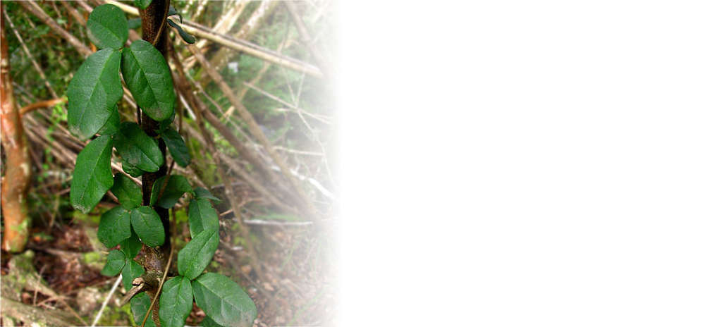

[](https://travis-ci.org/levibostian/Boquila)
[](https://cocoapods.org/pods/Boquila)
[](https://cocoapods.org/pods/Boquila)
[](https://cocoapods.org/pods/Boquila)


# Boquila

Small, consistent, flexible way to work with remote config. 



*Note: Boquila is a WIP. It may be used in production today, but the future of Boquila is unknown. At this time, it is a very small library that does not solve a big problem. This project may discontinue development, the API may change, it is all unknown.*

## What is Boquila? 

I love using remote configuration software in my mobile apps. They allow me to make changes to live apps instantly without having to submit my app to the app store. 

While working with remote configuration in my apps, I have thought about some cool ideas for using remote config in my apps. Using JSON strings for remote config values and string replacements for dynamic values just to name a few. 

Boquila is a project for lovers of remote configuration software. Boquila aims to...
* **Be small.** Don't try to do everything including the kitchen sink. Try to be as minimal of a project as possible and allow the developer to opt-in to features they want. 
* **Consistent experience.** No matter what remote config service that you use, the API remains the same. 
* **Flexible.** Boquila is not opinionated. It does only what it needs to do and nothing more. 

## Remote config providers

* [Firebase Remote Config](https://firebase.google.com/docs/remote-config) - Implemented. 
* [Azure App Configuration](https://docs.microsoft.com/en-us/azure/azure-app-configuration/overview) - Not planned. Contribute to this project to add it. 
* [Optimizely remote config](https://blog.optimizely.com/2020/04/02/remote-configuration-mobile-apps/) - Not planned. Contribute to this project to add it. 
* [Mixpanel](https://mixpanel.com/) - Not planned. Contribute to this project to add it. 
* ...We may be missing some providers. Contribute to this project to add more!

## Installation

Boquila is available through [CocoaPods](https://cocoapods.org/pods/Boquila). To install it, simply add the following line to your Podfile:

```ruby
pod 'Boquila', '~> version-here'
```

Replace `version-here` with: [](https://cocoapods.org/pods/Boquila) as this is the latest version at this time.

The `Boquila` pod on it's own is very boring. It doesn't really do anything at all. You want to add more pods to your project depending on what you want to do. Here are all of your options:

| Title              | Description                                                                                 |
--------------------------------------------------------------------------------------------------------------------
| `Boquila/Firebase` | Use `Boquila` with [Firebase Remote Config](https://firebase.google.com/docs/remote-config) |

# Getting started 

To learn how to use `Boquila`, check out the documentation for each of the options you have installed. 

* [Boquila/Firebase documentation](Boquila/Firebase/README.md)

## Example app

This project comes with an iOS app but it doesn't really do anything at this time.

To run the example app, follow these instructions:
```
cd Example/
pod install
```
Then, open the Boquila workspace in XCode.  

## Contribute

Boquila is open for pull requests. Check out the [list of issues](https://github.com/levibostian/Boquila/issues) for tasks planned out, if there are any. Check them out if you wish to contribute in that way.

**Want to add features to Boquila?** Before you decide to take a bunch of time and add functionality to the library, please, [create an issue](https://github.com/levibostian/Boquila/issues/new) stating what you wish to add. This might save you some time in case your purpose does not fit well in the use cases of Boquila. Nothing is stopping you from making a fork of this library and making any changes you wish!

# Where did the name come from?

When I think of remote configuration, I think of the word "adaptive". Able to change over time depending on the needs at that time. The [Boquila](https://en.wikipedia.org/wiki/Boquila) plant is one of the most mysterious plants in the world *because of its ability to mimic its leaves to the leaves of the hosts that are supporting them*. 

## License

Boquila is available under the MIT license. See the LICENSE file for more info.
